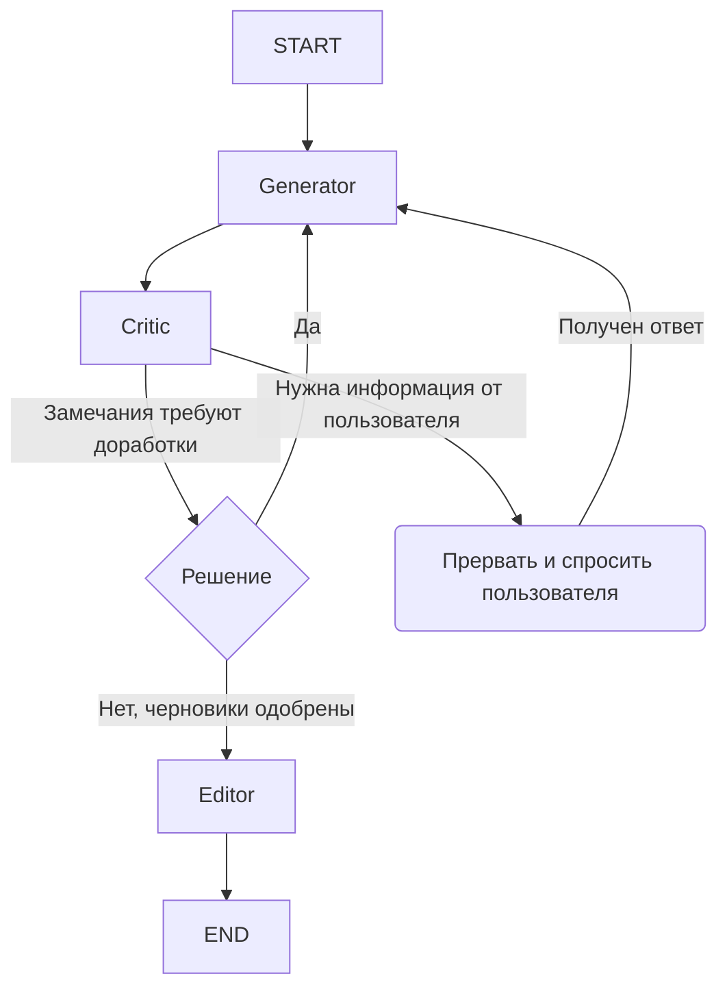

# 🤖 Консилиум для Конспектов

MVP (Minimum Viable Product) системы "Консилиум для Конспектов". Система предназначена для генерации и валидации учебных конспектов по заданной пользователем теме с использованием мультиагентного подхода. Команда LLM-агентов, оркестрируемая с помощью `LangGraph`, совместно создает, критикует и редактирует текст для достижения высокого качества и достоверности итогового материала.

## 🎯 Ключевые цели MVP

*   **Быстрая реализация:** Создать работающий прототип, используя высокоуровневые фреймворки (`Streamlit`, `LangGraph`).

*   **Низкие требования к ресурсам:** Обеспечить возможность развертывания на серверах класса free-tier (1-2 vCPU, 1-2 ГБ RAM) за счет использования внешнего LLM API.

*   **Простота использования и развертывания:** Реализовать интуитивно понятный чат-интерфейс и обеспечить запуск всей системы одной командой `docker-compose up`.

*   **Валидация концепции:** Проверить жизнеспособность архитектуры "консилиума" для улучшения качества генерируемого контента.

*   **Модульная архитектура:** Код разделен на логические модули (не более 170 строк каждый) для удобства поддержки и развития.

## ✨ Возможности

*   **Мультиагентная генерация:** Три агента-генератора создают черновики с разных точек зрения (структурный план, подробное изложение, фокус на примерах).

*   **Критика и итерации:** Агент-критик оценивает черновики, запрашивает доработки или задает уточняющие вопросы пользователю.

*   **Финальная редактура:** Агент-редактор собирает лучший итоговый конспект из одобренных черновиков с учетом критики.

*   **Простой UI:** Интуитивно понятный чат-интерфейс на базе `Streamlit` с темной темой в стиле Deepseek.

*   **История чатов:** Все диалоги сохраняются в базе данных `SQLite` и доступны для просмотра.

*   **Поддержка контекста:** Возможность загрузить текстовый файл (`.txt`, `.md`) для более точной генерации.

*   **Логирование:** Все ответы агентов записываются в лог-файлы для анализа и отладки.

## 🏗️ Архитектура

Система реализована в виде единого монолитного сервиса, упакованного в Docker-контейнер. Streamlit-приложение выполняет роль как фронтенда (UI), так и бэкенда, запуская и управляя логикой `LangGraph`. База данных SQLite хранится в виде файла в персистентном томе (volume).

### Структура проекта

Проект организован в модульную структуру, где каждый файл не превышает 170 строк:

```
Consilium/
├── app.py                 # Точка входа приложения
├── config.py              # Константы и настройки
├── database.py            # Операции с базой данных
├── db_schema.py           # Инициализация схемы БД
├── logging.py             # Логирование работы агентов
├── llm_setup.py           # Настройка LLM и промптов
├── decision.py            # Определение AgentState и функция принятия решений
├── generator.py           # Узел генератора черновиков
├── critic_editor.py       # Узлы критика и редактора
├── agents.py              # Модуль-обертка для импорта узлов
├── graph.py               # Построение графа агентов
├── ui.py                  # Главная функция отрисовки UI
├── ui_styles.py           # Кастомные CSS стили
├── ui_components.py       # Компоненты UI (sidebar, messages)
├── ui_handler.py          # Обработка пользовательского ввода
├── prompts/               # Промпты для агентов
│   ├── generator.txt
│   ├── critic.txt
│   └── editor.txt
├── data/                  # База данных SQLite
├── logs/                  # Логи работы агентов
├── Dockerfile
├── docker-compose.yml
└── requirements.txt
```

### Диаграмма взаимодействия компонентов

```mermaid
graph TD
    subgraph "Пользовательский браузер"
        UI(🖼️ Streamlit UI)
    end

    subgraph "Docker-контейнер: app"
        A[Сервер Streamlit]
        B[Логика LangGraph]
        C[<-->]
        D[💾 SQLite (history.db)]
        E[📝 Логи агентов]
    end

    subgraph "Внешние сервисы"
        F[☁️ Deepseek LLM API]
    end

    UI -- HTTP/WebSocket --> A
    A -- Запускает --> B
    B -- Вызывает --> F
    A -- Чтение/Запись истории --> D
    B -- Запись логов --> E
    A -- Отображает результат --> UI

    style D fill:#f9f,stroke:#333,stroke-width:2px
    style E fill:#ff9,stroke:#333,stroke-width:2px
    style F fill:#ccf,stroke:#333,stroke-width:2px
```

### Логика графа `LangGraph`



### Описание модулей

*   **config.py** - Централизованное хранение всех констант, путей к файлам и настроек приложения.

*   **database.py / db_schema.py** - Работа с базой данных SQLite: создание чатов, сохранение и загрузка сообщений.

*   **logging.py** - Логирование всех ответов агентов в JSONL формате для последующего анализа.

*   **llm_setup.py** - Инициализация LLM (Deepseek), загрузка промптов из файлов и создание шаблонов.

*   **decision.py** - Определение структуры состояния графа (AgentState) и функция принятия решений о следующем шаге.

*   **generator.py** - Узел генератора, создающий три черновика конспекта параллельно в разных стилях.

*   **critic_editor.py** - Узлы критика (анализ черновиков) и редактора (создание финального конспекта).

*   **graph.py** - Построение и компиляция графа агентов с использованием LangGraph.

*   **ui.py / ui_styles.py / ui_components.py / ui_handler.py** - Модули пользовательского интерфейса: отрисовка компонентов, стили, обработка ввода.

## 🚀 Как запустить

### Требования

*   [Docker](https://www.docker.com/get-started)
*   [Docker Compose](https://docs.docker.com/compose/install/)

### Шаги запуска

1.  **Клонируйте репозиторий:**

    ```bash
    git clone <URL_репозитория>
    cd <имя_папки_проекта>
    ```

2.  **Создайте файл `.env`:**

    Создайте файл `.env` в корне проекта и добавьте в него ваш API-ключ от [Deepseek](https://www.deepseek.com/).

    ```env
    DEEPSEEK_API_KEY="sk-xxxxxxxxxxxxxxxxxxxxxxxx"
    
    # Опционально: можно не указывать, если используется стандартный URL
    OPENAI_API_BASE="https://api.deepseek.com/v1"
    
    # Опционально: можно указать модель (по умолчанию deepseek-chat)
    DEEPSEEK_MODEL="deepseek-chat"
    
    # Опционально: можно указать отдельные ключи для каждого генератора
    DEEPSEEK_API_KEY_GENERATOR_1="sk-..."
    DEEPSEEK_API_KEY_GENERATOR_2="sk-..."
    DEEPSEEK_API_KEY_GENERATOR_3="sk-..."
    ```

3.  **Создайте директории для данных и логов:**

    Эти директории необходимы для персистентного хранения базы данных SQLite и логов.

    ```bash
    mkdir -p data logs
    ```

4.  **Запустите приложение с помощью Docker Compose:**

    Эта команда соберет Docker-образ и запустит контейнер в фоновом режиме.

    ```bash
    docker-compose up --build -d
    ```

5.  **Откройте приложение в браузере:**

    Перейдите по адресу `http://localhost:8501`.

### Локальный запуск (без Docker)

Для разработки можно запустить приложение локально:

```bash
# Установите зависимости
pip install -r requirements.txt

# Создайте директории
mkdir -p data logs

# Запустите приложение
streamlit run app.py
```

## 🛠️ Технологический стек

*   **Язык:** Python 3.10+
*   **Frontend/Backend:** Streamlit
*   **Оркестрация LLM:** LangChain, LangGraph
*   **LLM:** Deepseek (через OpenAI-совместимый API)
*   **База данных:** SQLite
*   **Контейнеризация:** Docker, Docker Compose

## 📝 Особенности реализации

*   **Модульная архитектура:** Код разделен на логические модули, каждый не превышает 170 строк для удобства поддержки.

*   **Подробные комментарии:** Все модули содержат подробные комментарии на русском языке, объясняющие назначение и работу функций.

*   **Логирование:** Все ответы агентов записываются в лог-файлы в формате JSONL для последующего анализа.

*   **Обработка ошибок:** Система корректно обрабатывает ошибки парсинга JSON от критика и другие исключительные ситуации.

*   **Кэширование:** LLM и граф агентов кэшируются между перезапусками Streamlit для повышения производительности.

## 🔧 Разработка

### Структура кода

Проект следует принципам модульности и разделения ответственности:

- **Конфигурация** (`config.py`) - все настройки в одном месте
- **Данные** (`database.py`, `db_schema.py`) - работа с БД
- **Логика агентов** (`generator.py`, `critic_editor.py`, `decision.py`) - узлы графа
- **Оркестрация** (`graph.py`) - построение графа
- **UI** (`ui.py`, `ui_*.py`) - пользовательский интерфейс

### Добавление новых агентов

Для добавления нового агента:

1. Создайте промпт в `prompts/`
2. Загрузите промпт в `llm_setup.py`
3. Создайте узел в отдельном модуле или `critic_editor.py`
4. Добавьте узел в граф в `graph.py`

## 📄 Лицензия

Проект создан в образовательных целях.

